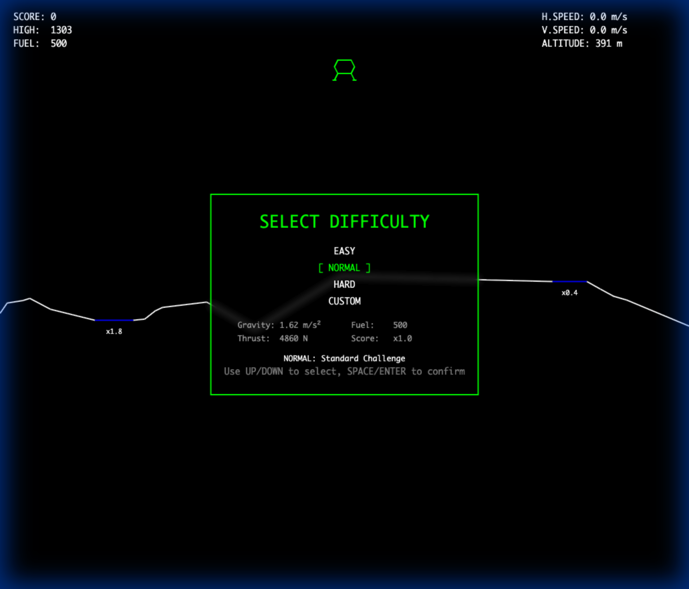

# Lunar Lander

レトロスタイルのLunar Lander(月面着陸船)ゲーム。ワイヤーフレームグラフィックスで、クラシックなアーケードゲームの雰囲気を再現しています。



## 🤖 AI生成プロジェクトについて

このプロダクトは **Google Gemini 2.0 Flash (Experimental)** および **Antigravity** のテストのために作成されました。

**重要な特徴:**
- 人間が**コードを一行も書かず**、AIへの指示のみで開発されました
- すべてのコード、テスト、ドキュメントはAIによって生成されています
- プロジェクト構造、アーキテクチャ設計、実装の詳細まで、すべてAIとの対話を通じて構築されました

このプロジェクトは、最新のAI技術がソフトウェア開発においてどこまで実用的な成果を生み出せるかを実証するものです。

## 🎮 ゲームについて

月面に安全に着陸船を着陸させる物理ベースのシミュレーションゲームです。燃料と速度を管理しながら、慎重に着陸パッドを目指しましょう。

### 特徴

- **物理シミュレーション**: リアルな重力、慣性、推力の物理演算
- **複雑な地形**: オーバーハングを含む複雑な地形生成
- **スコアシステム**: 着陸難易度に応じたスコア倍率(x1〜x10)
- **ハイスコア**: localStorageによる最高スコア保存
- **ワイヤーフレーム描画**: レトロなベクターグラフィックス風の描画
- **衝突判定**: 精密な線分交差判定による衝突検出
- **クラッシュアニメーション**: 破片と炎のエフェクト

## 🕹️ 操作方法

| キー | 操作 |
|------|------|
| `←` / `A` | 左回転 |
| `→` / `D` | 右回転 |
| `↑` / `W` | メインスラスター(推力) |
| `Space` | ゲーム再開(ゲームオーバー後) |

## 🎯 ゲームルール

### 着陸条件

安全に着陸するには以下の条件を満たす必要があります:

- **速度**: 2.0 以下
- **角度**: 垂直から±17度以内
- **着陸位置**: 着陸パッド(青/黄/赤の平面)上

### スコア計算

```
スコア = (100 + 残り燃料/10) × パッド倍率
```

- **青パッド**: x1 (簡単)
- **黄パッド**: x3-x4 (中程度)
- **赤パッド**: x5-x10 (困難)

## 🚀 クイックスタート

### 前提条件

- Node.js 18以上
- npm

### インストール

```bash
# リポジトリをクローン
git clone https://github.com/sugitach/Lunar-Lander.git
cd Lunar-Lander

# 依存関係をインストール
npm install
```

### 開発サーバーの起動

```bash
npx vite
```

ブラウザで `http://localhost:5173` を開いてゲームをプレイできます。

### ビルド

```bash
npm run build
```

ビルドされたファイルは `dist/` ディレクトリに出力されます。

### テスト実行

```bash
# テストを一回実行
npm test

# ウォッチモードでテスト
npm run test:watch

# UIモードでテスト
npm run test:ui
```

## 🏗️ 技術スタック

- **TypeScript**: 型安全な開発
- **Vite**: 高速なビルドツール
- **Canvas API**: 2Dグラフィックス描画
- **Vitest**: ユニットテストフレームワーク

## 📁 プロジェクト構造

```
src/
├── core/              # コアシステム
│   ├── GameLoop.ts           # メインゲームループ
│   ├── GameState.ts          # ゲーム状態管理
│   ├── GameStateManager.ts   # 着陸/クラッシュ判定
│   ├── Physics.ts            # 物理演算
│   ├── CollisionDetector.ts  # 衝突判定
│   ├── DebrisManager.ts      # 破片管理
│   └── ...
├── entities/          # ゲームエンティティ
│   ├── Lander.ts      # 着陸船
│   ├── Terrain.ts     # 地形生成
│   └── Debris.ts      # 破片
├── renderer/          # 描画システム
│   ├── IRenderer.ts          # レンダラーインターフェース
│   └── WireframeRenderer.ts  # ワイヤーフレーム描画
├── input/             # 入力処理
│   └── KeyboardInput.ts
└── main.ts            # エントリーポイント
```

## 🧪 テスト

プロジェクトには包括的なユニットテストが含まれています:

- 物理演算のテスト
- 衝突判定のテスト
- ゲーム状態管理のテスト
- 地形生成のテスト

テストカバレッジ: 24/24 テストが合格

## 🔮 今後の予定

- [ ] サウンドエフェクト
- [ ] レベル選択
- [ ] マルチプレイヤーモード
- [ ] 3D版への移行(Three.js)

## 📝 ライセンス

このプロジェクトはMITライセンスの下で公開されています。

## 👤 作成者

**sugitach**

- GitHub: [@sugitach](https://github.com/sugitach)

## 🙏 謝辞

クラシックなAtari Lunar Landerゲームにインスパイアされて作成されました。
